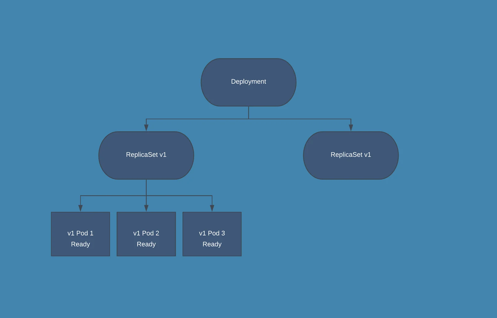
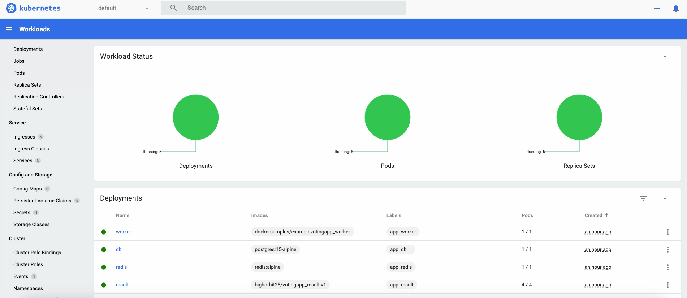

# Containerization PoC for Customer ABC

## Background
Customer ABC currently have applications deployed on VMs and are interested in containerization and its benefits hence
requesting a PoC. The PoC is to demonstrate how application containerization can support rolling updates for 0 downtime or
minimal downtime during application upgrades.

## Prequisties
- [Docker Desktop](https://www.docker.com/products/docker-desktop): Docker Desktop provides an easy-to-use environment for building, running, and managing containers on your local machine. In this PoC, it is used to containerize application components, ensuring consistency and portability across environments.
- [Kubernetes](https://kubernetes.io/releases/download/): Kubernetes is a powerful container orchestration platform that automates deployment, scaling, and management of containerized applications. Here, it demonstrates how to manage distributed applications and perform rolling updates with minimal downtime.
- [minikube](https://minikube.sigs.k8s.io/docs/start/): minikube is a local Kubernetes environment that runs a single-node cluster on your machine. It is used in this PoC to quickly set up and test Kubernetes workloads without needing a full-scale cloud cluster.

## Voting App
For this PoC, we will be using [example-voting-app](https://github.com/dockersamples/example-voting-app/tree/main) from dockersamples
as our sample app. This is a simple distributed application running across multiple Docker containers.

## Architecture
This solution uses Python, Node.js, .NET, with Redis for messaging and Postgres for storage.


* A front-end web app in [Python](/vote) which lets you vote between two options
* A [Redis](https://hub.docker.com/_/redis/) which collects new votes
* A [.NET](/worker/) worker which consumes votes and stores them in…
* A [Postgres](https://hub.docker.com/_/postgres/) database backed by a Docker volume
* A [Node.js](/result) web app which shows the results of the voting in real time

## Rolling Update
Rolling update is Kubernetes's default deployment strategy. This approach updates applications 
incrementally by replacing existing instances with new ones in a controlled way.

How it works:
- **Pod Replacement**: Kubernetes swaps out old Pods with updated pods.
- **Gradual Rollout**: It maintains a set number of healthy Pods before removing the old ones 
- **Controlled Progress**: The update process is controlled by configuring maxUnavailable and maxSurge in the deployment
YAML specification.

To demonstrate rolling updates for 0 downtime during application upgrades, let us focus on configuring deployment strategy for
[result-deployment.yaml](k8s-specifications/result-deployment.yaml)

```
spec:
  strategy:
    type: RollingUpdate
    rollingUpdate:
      maxUnavailable: 0
      maxSurge: 1
  replicas: 4
```

`maxUnavailable`--- _Absolute number (eg, 1) or a percentage of desired Pods (eg, 10%)._

- Only a certain number of Pods are down while they are being updated. By default, it ensures that at least 75% of the desired number of Pods are up (25% max unavailable).
- We set `maxUnavailable: 0` to ensure no reduction in capacity during updates,

`maxSurge`--- _Absolute number (eg, 1) or a percentage of desired Pods (eg, 10%)._

- Only a certain number of Pods are created above the desired number of Pods. By default, it ensures that at most 125% of the desired number of Pods are up (25% max surge).
- We set `maxSurge: 1` to allow creating one additional pod during the update. 

In our case with 4 replicas configured for `result`,the above rollingUpdate configuration will 
make sure that **at least 4 Pods** are available and that **at max 5 Pods** in total are available. 



_Illustration taken from (https://www.bluematador.com/blog/kubernetes-deployments-rolling-update-configuration)_

For example, if you look at the above Deployment closely, you will see that it first creates a 
new Pod, then deletes an old Pod, and creates another new one. It does not kill old Pods until 
a sufficient number of new Pods have come up, and does not create new Pods until a sufficient 
number of old Pods have been killed.

## Readiness Probe
Readiness probes help Kubernetes determine whether an Pod is ready to serve traffic.
Readiness probes are essential for zero-downtime updates as they:

- Verify that new pods are fully operational before receiving traffic

- Prevent premature traffic routing to pods that aren't ready

- Allow graceful initialization of application components
```
readinessProbe:
  httpGet:
    path: /
    port: 80
  initialDelaySeconds: 5
  periodSeconds: 5
  timeoutSeconds: 1
  successThreshold: 1
  failureThreshold: 3
```

We probe by sending an HTTP GET request to the “/” endpoint on port 80 and 
expect a 200-400 range status code response. The probe waits 5 seconds before 
starting, runs every 5 seconds, and has a timeout of 1 second. If the probe fails three times 
in a row, the container is considered not ready.

## Scenario 1: Initial Deployment
### 1. Set up a single-node Kubernetes cluster using Minikube
```shell
minikube start
```

### 2. Deploy the voting application components

Run the following command to create the deployments and services.
```shell
kubectl create -f k8s-specifications/
```

> **_NOTE:_**
The folder [k8s-specifications](k8s-specifications) contains the YAML specifications of the Voting App's services.

```
kubectl get pods
NAME                      READY   STATUS    RESTARTS   AGE
db-74574d66dd-d6q4g       1/1     Running   0          41s
redis-6c5fb9c4b7-qxqr5    1/1     Running   0          41s
result-759ddd7c59-54tr8   1/1     Running   0          41s
result-759ddd7c59-77cqh   1/1     Running   0          41s
result-759ddd7c59-bkkhj   1/1     Running   0          41s
result-759ddd7c59-lwcjz   1/1     Running   0          41s
vote-5d74dcd7c7-mtlx4     1/1     Running   0          41s
worker-6f5f6cdd56-2glb2   1/1     Running   0          40s

kubectl get services
NAME         TYPE        CLUSTER-IP       EXTERNAL-IP   PORT(S)          AGE
db           ClusterIP   10.99.52.231     <none>        5432/TCP         41s
kubernetes   ClusterIP   10.96.0.1        <none>        443/TCP          2m14s
redis        ClusterIP   10.109.243.137   <none>        6379/TCP         41s
result       NodePort    10.110.204.85    <none>        8081:31001/TCP   41s
vote         NodePort    10.96.200.44     <none>        8080:31000/TCP   41s
```
There are 4 result pods as per our `replicas: 4`

### 3. Launch minikube dashboard
We can use this minikube UI dashboard to monitor our deployment

```shell
minikube dashboard
```

```
minikube dashboard
🤔  Verifying dashboard health ...
🚀  Launching proxy ...
🤔  Verifying proxy health ...
🎉  Opening http://127.0.0.1:58288/api/v1/namespaces/kubernetes-dashboard/services/http:kubernetes-dashboard:/proxy/ in your default browser...
```


### 4. Verify the application is accessible and functioning on browser
To launch the web apps on your browser, run the following commands in separate terminals
```shell
minikube service vote
```

```shell
minikube service result
```

> **_NOTE:_** Because you are using a Docker driver on darwin, the terminal 
> needs to be open to run it.


## Scenario 2: Zero-Downtime Application Update
### 1. Create a new version of the voting application
Suppose there is a new update to the result application.

**Change:** Display the current leader and the vote difference in result.

After building the image, the updated v2 result image is similarly uploaded to the docker repository.


### 2. Update the Kubernetes deployment with the new image version
Run the following command to update the result deployment
```shell
kubectl set image deployment/result result=highorbit25/votingapp_result:v2
```

### 3. Monitor the rolling update process
```shell
kubectl rollout status deployment/result
```
```
Waiting for deployment "result" rollout to finish: 1 out of 4 new replicas have been updated...
Waiting for deployment "result" rollout to finish: 1 out of 4 new replicas have been updated...
Waiting for deployment "result" rollout to finish: 1 out of 4 new replicas have been updated...
Waiting for deployment "result" rollout to finish: 2 out of 4 new replicas have been updated...
Waiting for deployment "result" rollout to finish: 2 out of 4 new replicas have been updated...
Waiting for deployment "result" rollout to finish: 2 out of 4 new replicas have been updated...
Waiting for deployment "result" rollout to finish: 3 out of 4 new replicas have been updated...
Waiting for deployment "result" rollout to finish: 3 out of 4 new replicas have been updated...
Waiting for deployment "result" rollout to finish: 3 out of 4 new replicas have been updated...
Waiting for deployment "result" rollout to finish: 1 old replicas are pending termination...
Waiting for deployment "result" rollout to finish: 1 old replicas are pending termination...
deployment "result" successfully rolled out
```


### 4. Verify continuous application availability during the update

We observe that result application remains available throughout the rolling update

## Scenario 3: Rollback to previous deployment
### 1. Revert to previous deployment
If we encounter any issues with the new deployment, we have the option to easily rollback to the previous deployment.

Run the following command to revert the result deployment
```shell
kubectl rollout undo deployments/result
```

### 3. Verify result has been reverted to v1 version


## High Availability Analysis
This architecture provide high availability, but not without limitations given the single-host constraint.

The architecture provides high availability at the application level through:

- **Container Redundancy:** Multiple replicas of the application run simultaneously, allowing the service to remain available even if some containers fail.

- **Self-Healing:** Kubernetes automatically restarts failed containers and reschedules pods if they become unhealthy.

- **Rolling Updates:** The ability to update applications without downtime ensures continuous service availability during maintenance.

- **Health Monitoring:** Readiness and liveness probes can continuously verify application health and automatically remove unhealthy instances from service.

### Limitations of Single-Host Architecture
While the architecture achieves application-level high availability, it has infrastructure-level limitations:

- **Single Point of Failure:** The entire system depends on one physical/virtual machine. If the host fails, all containers will be unavailable.

- **Resource Constraints:** A single host has limited resources, potentially affecting performance during peak loads or updates.

- **Availability Metrics:** A single-host configuration typically provides around 99.5% availability, whereas a multi-host setup would be necessary for 99.9% or higher.

### Recommendations for Production Implementation
For a production environment, I would recommend:

- **Multi-Node Cluster:** Distribute containers across multiple nodes to eliminate single points of failure.

- **Control Plane Redundancy:** Implement a multi-master Kubernetes setup for control plane high availability.

- **Cross-Zone Deployment:** Distribute nodes across different availability zones for infrastructure resilience.

- **Stateful Service Management:** Implement proper backup and replication strategies for stateful services like databases


## Clean up
To remove deployments and services, run:

```shell
kubectl delete -f k8s-specifications/
```


